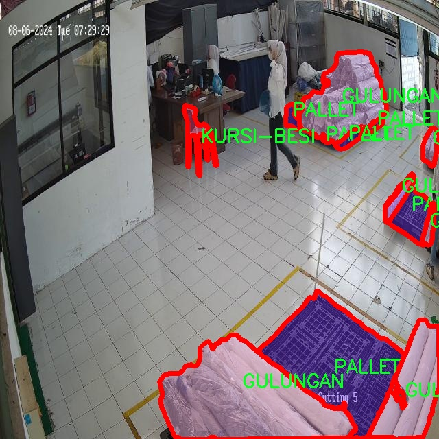

### 1.背景意义

### 研究背景与意义

随着现代物流和仓储管理的快速发展，物品分类与检测技术在提高仓库运营效率、降低人工成本方面发挥着越来越重要的作用。传统的物品管理方式往往依赖人工识别和分类，效率低下且容易出错。为了解决这一问题，基于计算机视觉的自动化物品分类检测系统应运而生。近年来，深度学习技术的进步，尤其是目标检测算法的不断优化，使得这一领域的研究取得了显著的进展。

YOLO（You Only Look Once）系列算法作为目标检测领域的佼佼者，以其高效的实时检测能力和良好的准确性，成为了许多应用场景的首选。YOLOv11作为该系列的最新版本，结合了更先进的网络结构和优化策略，能够在复杂环境中实现更高效的物品检测和分类。然而，现有的YOLOv11模型在特定应用场景中的表现仍有提升空间，尤其是在仓库物品的细粒度分类和图像分割任务中。

本研究旨在基于改进的YOLOv11算法，构建一个针对仓库物品的分类检测与图像分割系统。我们将使用包含2000张图像的5S数据集，该数据集涵盖了12种不同类别的物品，包括箱子、手推车、托盘等。这些类别的多样性为模型的训练和评估提供了丰富的样本，能够有效提升模型的泛化能力和实际应用效果。

通过对YOLOv11的改进，我们希望能够在物品检测的准确性和速度上实现突破，进而为仓库管理提供更为智能化的解决方案。该系统的成功实施将为物流行业的数字化转型提供有力支持，推动智能仓储技术的发展，并为相关领域的研究提供新的思路和方法。

### 2.视频效果

[2.1 视频效果](https://www.bilibili.com/video/BV1jRqVYPE7a/)

### 3.图片效果


##### [项目涉及的源码数据来源链接](https://kdocs.cn/l/cszuIiCKVNis)**

注意：本项目提供训练的数据集和训练教程,由于版本持续更新,暂不提供权重文件（best.pt）,请按照6.训练教程进行训练后实现上图演示的效果。

### 4.数据集信息

##### 4.1 本项目数据集类别数＆类别名

nc: 11
names: ['BOX', 'BUNDLING', 'GULUNGAN', 'HAND-PALLET', 'KONTAINER', 'KURSI-BESI', 'OTHER', 'PALLET', 'PENGKI', 'SAPU', 'TRASH']


该项目为【图像分割】数据集，请在【训练教程和Web端加载模型教程（第三步）】这一步的时候按照【图像分割】部分的教程来训练

##### 4.2 本项目数据集信息介绍

本项目数据集信息介绍

本项目旨在通过改进YOLOv11模型，构建一个高效的仓库物品分类检测图像分割系统，以提升仓库管理的智能化水平。为实现这一目标，我们构建了一个专门的数据集，主题围绕“5S”管理理念展开，强调在仓库环境中物品的整理、整顿、清扫、清洁和素养的重要性。该数据集包含11个类别，涵盖了仓库中常见的物品类型，具体包括：BOX（箱子）、BUNDLING（捆绑物）、GULUNGAN（卷筒）、HAND-PALLET（手动托盘）、KONTAINER（集装箱）、KURSI-BESI（铁椅）、OTHER（其他物品）、PALLET（托盘）、PENGKI（铲子）、SAPU（扫帚）和TRASH（垃圾）。这些类别的选择不仅反映了仓库管理的实际需求，也为物品的分类和检测提供了多样化的视角。

数据集中的图像经过精心挑选和标注，确保每个类别的样本数量均衡，且涵盖了不同的拍摄角度、光照条件和背景环境。这种多样性使得模型在训练过程中能够学习到更为丰富的特征，从而提高其在实际应用中的鲁棒性和准确性。此外，数据集还考虑到了不同物品之间的相似性和差异性，确保模型能够有效地区分相近类别，减少误检和漏检的情况。

通过对该数据集的深入分析和应用，我们期望能够显著提升YOLOv11在仓库物品分类检测中的性能，进而推动“5S”管理理念在仓库环境中的落地实施。最终，我们希望该系统不仅能提高物品管理的效率，还能为仓库的整体运营提供数据支持和决策依据。





### 5.全套项目环境部署视频教程（零基础手把手教学）

[5.1 所需软件PyCharm和Anaconda安装教程（第一步）](https://www.bilibili.com/video/BV1BoC1YCEKi/?spm_id_from=333.999.0.0&vd_source=bc9aec86d164b67a7004b996143742dc)


[5.2 安装Python虚拟环境创建和依赖库安装视频教程（第二步）](https://www.bilibili.com/video/BV1ZoC1YCEBw?spm_id_from=333.788.videopod.sections&vd_source=bc9aec86d164b67a7004b996143742dc)

### 6.改进YOLOv11训练教程和Web_UI前端加载模型教程（零基础手把手教学）

[6.1 改进YOLOv11训练教程和Web_UI前端加载模型教程（第三步）](https://www.bilibili.com/video/BV1BoC1YCEhR?spm_id_from=333.788.videopod.sections&vd_source=bc9aec86d164b67a7004b996143742dc)


按照上面的训练视频教程链接加载项目提供的数据集，运行train.py即可开始训练



     Epoch   gpu_mem       box       obj       cls    labels  img_size
     1/200     20.8G   0.01576   0.01955  0.007536        22      1280: 100%|██████████| 849/849 [14:42<00:00,  1.04s/it]
               Class     Images     Labels          P          R     mAP@.5 mAP@.5:.95: 100%|██████████| 213/213 [01:14<00:00,  2.87it/s]
                 all       3395      17314      0.994      0.957      0.0957      0.0843

     Epoch   gpu_mem       box       obj       cls    labels  img_size
     2/200     20.8G   0.01578   0.01923  0.007006        22      1280: 100%|██████████| 849/849 [14:44<00:00,  1.04s/it]
               Class     Images     Labels          P          R     mAP@.5 mAP@.5:.95: 100%|██████████| 213/213 [01:12<00:00,  2.95it/s]
                 all       3395      17314      0.996      0.956      0.0957      0.0845

     Epoch   gpu_mem       box       obj       cls    labels  img_size
     3/200     20.8G   0.01561    0.0191  0.006895        27      1280: 100%|██████████| 849/849 [10:56<00:00,  1.29it/s]
               Class     Images     Labels          P          R     mAP@.5 mAP@.5:.95: 100%|███████   | 187/213 [00:52<00:00,  4.04it/s]
                 all       3395      17314      0.996      0.957      0.0957      0.0845


###### [项目数据集下载链接](https://kdocs.cn/l/cszuIiCKVNis)

### 7.原始YOLOv11算法讲解

YOLOv11是Ultralytics推出的YOLO系列最新版本，专为实现尖端的物体检测而设计。其架构和训练方法上进行了重大改进，使之不仅具备卓越的准确性和处理速度，还在计算效率上实现了一场革命。得益于其改进的主干和颈部架构，YOLOv11在特征提取和处理复杂任务时表现更加出色。在2024年9月27日，Ultralytics通过长达九小时的在线直播发布这一新作，展示了其在计算机视觉领域的革新。

YOLOv11通过精细的架构设计和优化训练流程，在保持高精度的同时，缩减了参数量，与YOLOv8m相比减少了22%的参数，使其在COCO数据集上的平均准确度（mAP）有所提升。这种效率的提高使YOLOv11非常适合部署在各种硬件环境中，包括边缘设备、云计算平台以及支持NVIDIA GPU的系统，确保在灵活性上的优势。

该模型支持广泛的任务，从对象检测、实例分割到图像分类、姿态估计和定向对象检测（OBB），几乎覆盖了计算机视觉的所有主要挑战。其创新的C3k2和C2PSA模块提升了网络深度和注意力机制的应用，提高了特征提取的效率和效果。同时，YOLOv11的改进网络结构也使之在复杂视觉任务上得以从容应对，成为各类计算机视觉任务的多功能选择。这些特性令YOLOv11在实施实时物体检测的各个领域中表现出众。
* * *

2024年9月27日，Ultralytics在线直播长达九小时，为YOLO11召开“发布会”

YOLO11 是 Ultralytics YOLO 系列实时物体检测器的最新版本，它以尖端的准确性、速度和效率重新定义了可能性。在之前 YOLO
版本的显著进步的基础上，YOLO11 在架构和训练方法方面进行了重大改进，使其成为各种计算机视觉任务的多功能选择。


##### YOLO11主要特点：

  * 增强的特征提取：YOLO11 采用了改进的主干和颈部架构，增强了特征提取能力，可实现更精确的对象检测和复杂任务性能。
  * 针对效率和速度进行了优化：YOLO11 引入了完善的架构设计和优化的训练流程，可提供更快的处理速度，并在准确度和性能之间保持最佳平衡。
  * 更少的参数，更高的准确度：借助模型设计的进步，YOLO11m 在 COCO 数据集上实现了更高的平均准确度 (mAP)，同时使用的参数比 YOLOv8m 少 22%，从而提高了计算效率，同时又不影响准确度。
  * 跨环境的适应性：YOLO11 可以无缝部署在各种环境中，包括边缘设备、云平台和支持 NVIDIA GPU 的系统，从而确保最大的灵活性。
  * 支持的任务范围广泛：无论是对象检测、实例分割、图像分类、姿势估计还是定向对象检测 (OBB)，YOLO11 都旨在满足各种计算机视觉挑战。

##### 支持的任务和模式

YOLO11 以 YOLOv8 中引入的多功能模型系列为基础，为各种计算机视觉任务提供增强的支持：

Model| Filenames| Task| Inference| Validation| Training| Export  
---|---|---|---|---|---|---  
YOLO11| yolol11n.pt, yolol11s.pt, yolol11m.pt, yolol11x.pt| Detection| ✅| ✅|
✅| ✅  
YOLO11-seg| yolol11n-seg.pt, yolol11s-seg.pt, yolol11m-seg.pt,
yolol11x-seg.pt| Instance Segmentation| ✅| ✅| ✅| ✅  
YOLO11-pose| yolol11n-pose.pt, yolol11s-pose.pt, yolol11m-pose.pt,
yolol11x-pose.pt| Pose/Keypoints| ✅| ✅| ✅| ✅  
YOLO11-obb| yolol11n-obb.pt, yolol11s-obb.pt, yolol11m-obb.pt,
yolol11x-obb.pt| Oriented Detection| ✅| ✅| ✅| ✅  
YOLO11-cls| yolol11n-cls.pt, yolol11s-cls.pt, yolol11m-cls.pt,
yolol11x-cls.pt| Classification| ✅| ✅| ✅| ✅  
  
##### 简单的 YOLO11 训练和推理示例

以下示例适用于用于对象检测的 YOLO11 Detect 模型。

    
    
    from ultralytics import YOLO
    
    # Load a model
    model = YOLO("yolo11n.pt")
    
    # Train the model
    train_results = model.train(
        data="coco8.yaml",  # path to dataset YAML
        epochs=100,  # number of training epochs
        imgsz=640,  # training image size
        device="cpu",  # device to run on, i.e. device=0 or device=0,1,2,3 or device=cpu
    )
    
    # Evaluate model performance on the validation set
    metrics = model.val()
    
    # Perform object detection on an image
    results = model("path/to/image.jpg")
    results[0].show()
    
    # Export the model to ONNX format
    path = model.export(format="onnx")  # return path to exported model

##### 支持部署于边缘设备

YOLO11 专为适应各种环境而设计，包括边缘设备。其优化的架构和高效的处理能力使其适合部署在边缘设备、云平台和支持 NVIDIA GPU
的系统上。这种灵活性确保 YOLO11 可用于各种应用，从移动设备上的实时检测到云环境中的复杂分割任务。有关部署选项的更多详细信息，请参阅导出文档。

##### YOLOv11 yaml文件

    
    
    # Ultralytics YOLO 🚀, AGPL-3.0 license
    # YOLO11 object detection model with P3-P5 outputs. For Usage examples see https://docs.ultralytics.com/tasks/detect
    
    # Parameters
    nc: 80 # number of classes
    scales: # model compound scaling constants, i.e. 'model=yolo11n.yaml' will call yolo11.yaml with scale 'n'
      # [depth, width, max_channels]
      n: [0.50, 0.25, 1024] # summary: 319 layers, 2624080 parameters, 2624064 gradients, 6.6 GFLOPs
      s: [0.50, 0.50, 1024] # summary: 319 layers, 9458752 parameters, 9458736 gradients, 21.7 GFLOPs
      m: [0.50, 1.00, 512] # summary: 409 layers, 20114688 parameters, 20114672 gradients, 68.5 GFLOPs
      l: [1.00, 1.00, 512] # summary: 631 layers, 25372160 parameters, 25372144 gradients, 87.6 GFLOPs
      x: [1.00, 1.50, 512] # summary: 631 layers, 56966176 parameters, 56966160 gradients, 196.0 GFLOPs
    
    # YOLO11n backbone
    backbone:
      # [from, repeats, module, args]
      - [-1, 1, Conv, [64, 3, 2]] # 0-P1/2
      - [-1, 1, Conv, [128, 3, 2]] # 1-P2/4
      - [-1, 2, C3k2, [256, False, 0.25]]
      - [-1, 1, Conv, [256, 3, 2]] # 3-P3/8
      - [-1, 2, C3k2, [512, False, 0.25]]
      - [-1, 1, Conv, [512, 3, 2]] # 5-P4/16
      - [-1, 2, C3k2, [512, True]]
      - [-1, 1, Conv, [1024, 3, 2]] # 7-P5/32
      - [-1, 2, C3k2, [1024, True]]
      - [-1, 1, SPPF, [1024, 5]] # 9
      - [-1, 2, C2PSA, [1024]] # 10
    
    # YOLO11n head
    head:
      - [-1, 1, nn.Upsample, [None, 2, "nearest"]]
      - [[-1, 6], 1, Concat, [1]] # cat backbone P4
      - [-1, 2, C3k2, [512, False]] # 13
    
      - [-1, 1, nn.Upsample, [None, 2, "nearest"]]
      - [[-1, 4], 1, Concat, [1]] # cat backbone P3
      - [-1, 2, C3k2, [256, False]] # 16 (P3/8-small)
    
      - [-1, 1, Conv, [256, 3, 2]]
      - [[-1, 13], 1, Concat, [1]] # cat head P4
      - [-1, 2, C3k2, [512, False]] # 19 (P4/16-medium)
    
      - [-1, 1, Conv, [512, 3, 2]]
      - [[-1, 10], 1, Concat, [1]] # cat head P5
      - [-1, 2, C3k2, [1024, True]] # 22 (P5/32-large)
    
      - [[16, 19, 22], 1, Detect, [nc]] # Detect(P3, P4, P5)
    

**YOLO11和YOLOv8 yaml文件的区别**


##### 改进模块代码

  * C3k2 

    
    
    class C3k2(C2f):
        """Faster Implementation of CSP Bottleneck with 2 convolutions."""
    
        def __init__(self, c1, c2, n=1, c3k=False, e=0.5, g=1, shortcut=True):
            """Initializes the C3k2 module, a faster CSP Bottleneck with 2 convolutions and optional C3k blocks."""
            super().__init__(c1, c2, n, shortcut, g, e)
            self.m = nn.ModuleList(
                C3k(self.c, self.c, 2, shortcut, g) if c3k else Bottleneck(self.c, self.c, shortcut, g) for _ in range(n)
            )

C3k2，它是具有两个卷积的CSP（Partial Cross Stage）瓶颈架构的更快实现。

**类继承：**

  * `C3k2`继承自类`C2f`。这表明`C2f`很可能实现了经过修改的基本CSP结构，而`C3k2`进一步优化或修改了此结构。

**构造函数（`__init__`）：**

  * `c1`：输入通道。

  * `c2`：输出通道。

  * `n`：瓶颈层数（默认为1）。

  * `c3k`：一个布尔标志，确定是否使用`C3k`块或常规`Bottleneck`块。

  * `e`：扩展比率，控制隐藏层的宽度（默认为0.5）。

  * `g`：分组卷积的组归一化参数或组数（默认值为 1）。

  * `shortcut`：一个布尔值，用于确定是否在网络中包含快捷方式连接（默认值为 `True`）。

**初始化：**

  * `super().__init__(c1, c2, n, short-cut, g, e)` 调用父类 `C2f` 的构造函数，初始化标准 CSP 组件，如通道数、快捷方式、组等。

**模块列表（`self.m`）：**

  * `nn.ModuleList` 存储 `C3k` 或 `Bottleneck` 模块，具体取决于 `c3k` 的值。

  * 如果 `c3k` 为 `True`，它会初始化 `C3k` 模块。`C3k` 模块接收以下参数：

  * `self.c`：通道数（源自 `C2f`）。

  * `2`：这表示在 `C3k` 块内使用了两个卷积层。

  * `shortcut` 和 `g`：从 `C3k2` 构造函数传递。

  * 如果 `c3k` 为 `False`，则初始化标准 `Bottleneck` 模块。

`for _ in range(n)` 表示将创建 `n` 个这样的块。

**总结：**

  * `C3k2` 实现了 CSP 瓶颈架构，可以选择使用自定义 `C3k` 块（具有两个卷积）或标准 `Bottleneck` 块，具体取决于 `c3k` 标志。

  * C2PSA

    
    
    class C2PSA(nn.Module):
        """
        C2PSA module with attention mechanism for enhanced feature extraction and processing.
    
        This module implements a convolutional block with attention mechanisms to enhance feature extraction and processing
        capabilities. It includes a series of PSABlock modules for self-attention and feed-forward operations.
    
        Attributes:
            c (int): Number of hidden channels.
            cv1 (Conv): 1x1 convolution layer to reduce the number of input channels to 2*c.
            cv2 (Conv): 1x1 convolution layer to reduce the number of output channels to c.
            m (nn.Sequential): Sequential container of PSABlock modules for attention and feed-forward operations.
    
        Methods:
            forward: Performs a forward pass through the C2PSA module, applying attention and feed-forward operations.
    
        Notes:
            This module essentially is the same as PSA module, but refactored to allow stacking more PSABlock modules.
    
        Examples:
            >>> c2psa = C2PSA(c1=256, c2=256, n=3, e=0.5)
            >>> input_tensor = torch.randn(1, 256, 64, 64)
            >>> output_tensor = c2psa(input_tensor)
        """
    
        def __init__(self, c1, c2, n=1, e=0.5):
            """Initializes the C2PSA module with specified input/output channels, number of layers, and expansion ratio."""
            super().__init__()
            assert c1 == c2
            self.c = int(c1 * e)
            self.cv1 = Conv(c1, 2 * self.c, 1, 1)
            self.cv2 = Conv(2 * self.c, c1, 1)
    
            self.m = nn.Sequential(*(PSABlock(self.c, attn_ratio=0.5, num_heads=self.c // 64) for _ in range(n)))
    
        def forward(self, x):
            """Processes the input tensor 'x' through a series of PSA blocks and returns the transformed tensor."""
            a, b = self.cv1(x).split((self.c, self.c), dim=1)
            b = self.m(b)
            return self.cv2(torch.cat((a, b), 1))

`C2PSA` 模块是一个自定义神经网络层，带有注意力机制，用于增强特征提取和处理。

**类概述**

  * **目的：**

  * `C2PSA` 模块引入了一个卷积块，利用注意力机制来改进特征提取和处理。

  * 它使用一系列 `PSABlock` 模块，这些模块可能代表某种形式的位置自注意力 (PSA)，并且该架构旨在允许堆叠多个 `PSABlock` 层。

**构造函数（`__init__`）：**

  * **参数：**

  * `c1`：输入通道（必须等于 `c2`）。

  * `c2`：输出通道（必须等于 `c1`）。

  * `n`：要堆叠的 `PSABlock` 模块数量（默认值为 1）。

  * `e`：扩展比率，用于计算隐藏通道的数量（默认值为 0.5）。

  * **属性：**

  * `self.c`：隐藏通道数，计算为 `int(c1 * e)`。

  * `self.cv1`：一个 `1x1` 卷积，将输入通道数从 `c1` 减少到 `2 * self.c`。这为将输入分成两部分做好准备。

  * `self.cv2`：另一个 `1x1` 卷积，处理后将通道维度恢复回 `c1`。

  * `self.m`：一系列 `PSABlock` 模块。每个 `PSABlock` 接收 `self.c` 通道，注意头的数量为 `self.c // 64`。每个块应用注意和前馈操作。

**前向方法：**

  * **输入：**

  * `x`，输入张量。

  * **操作：**

  1. `self.cv1(x)` 应用 `1x1` 卷积，将输入通道大小从 `c1` 减小到 `2 * self.c`。

  2. 生成的张量沿通道维度分为两部分，`a` 和 `b`。

  * `a`：第一个 `self.c` 通道。

  * `b`：剩余的 `self.c` 通道。

  1. `b` 通过顺序容器 `self.m`，它是 `PSABlock` 模块的堆栈。这部分经过基于注意的处理。

  2. 处理后的张量 `b` 与 `a` 连接。

  3. `self.cv2` 应用 `1x1` 卷积，将通道大小恢复为 `c1`。

  * **输出：**

  * 应用注意和卷积操作后的变换后的张量。

**总结：**

  * **C2PSA** 是一个增强型卷积模块，它通过堆叠的 `PSABlock` 模块应用位置自注意力。它拆分输入张量，将注意力应用于其中一部分，然后重新组合并通过最终卷积对其进行处理。此结构有助于从输入数据中提取复杂特征。

##### 网络结构


### 8.200+种全套改进YOLOV11创新点原理讲解

#### 8.1 200+种全套改进YOLOV11创新点原理讲解大全

由于篇幅限制，每个创新点的具体原理讲解就不全部展开，具体见下列网址中的改进模块对应项目的技术原理博客网址【Blog】（创新点均为模块化搭建，原理适配YOLOv5~YOLOv11等各种版本）

[改进模块技术原理博客【Blog】网址链接](https://gitee.com/qunmasj/good)


#### 8.2 精选部分改进YOLOV11创新点原理讲解

###### 这里节选部分改进创新点展开原理讲解(完整的改进原理见上图和[改进模块技术原理博客链接](https://gitee.com/qunmasj/good)【如果此小节的图加载失败可以通过CSDN或者Github搜索该博客的标题访问原始博客，原始博客图片显示正常】


### LSKNet的架构
该博客提出的结构层级依次为：

LSK module（大核卷积序列+空间选择机制） < LSK Block （LK Selection + FFN）<LSKNet（N个LSK Block）


#### LSK 模块

LSK Block
LSKNet 是主干网络中的一个可重复堆叠的块（Block），每个LSK Block包括两个残差子块，即大核选择子块（Large Kernel Selection，LK Selection）和前馈网络子块（Feed-forward Network ，FFN），如图8。LK Selection子块根据需要动态地调整网络的感受野，FFN子块用于通道混合和特征细化，由一个全连接层、一个深度卷积、一个 GELU 激活和第二个全连接层组成。

LSK module（LSK 模块，图4）由一个大核卷积序列（large kernel convolutions）和一个空间核选择机制（spatial kernel selection mechanism）组成，被嵌入到了LSK Block 的 LK Selection子块中。

#### Large Kernel Convolutions
因为不同类型的目标对背景信息的需求不同，这就需要模型能够自适应选择不同大小的背景范围。因此，作者通过解耦出一系列具有大卷积核、且不断扩张的Depth-wise 卷积，构建了一个更大感受野的网络。

具体地，假设序列中第i个Depth-wise 卷积核的大小为 ，扩张率为 d，感受野为 ，它们满足以下关系：


卷积核大小和扩张率的增加保证了感受野能够快速增大。此外，我们设置了扩张率的上限，以保证扩张卷积不会引入特征图之间的差距。


Table2的卷积核大小可根据公式（1）和（2）计算，详见下图：


这样设计的好处有两点。首先，能够产生具有多种不同大小感受野的特征，便于后续的核选择；第二，序列解耦比简单的使用一个大型卷积核效果更好。如上图表2所示，解耦操作相对于标准的大型卷积核，有效地将低了模型的参数量。

为了从输入数据  的不同区域获取丰富的背景信息特征，可采用一系列解耦的、不用感受野的Depth-wise 卷积核：


其中，是卷积核为 、扩张率为  的Depth-wise 卷积操作。假设有个解耦的卷积核，每个卷积操作后又要经过一个的卷积层进行空间特征向量的通道融合。


之后，针对不同的目标，可基于获取的多尺度特征，通过下文中的选择机制动态选择合适的卷积核大小。

这一段的意思可以简单理解为：

把一个大的卷积核拆成了几个小的卷积核，比如一个大小为5，扩张率为1的卷积核加上一个大小为7，扩张率为3的卷积核，感受野为23，与一个大小为23，扩张率为1的卷积核的感受野是一样的。因此可用两个小的卷积核替代一个大的卷积核，同理一个大小为29的卷积核也可以用三个小的卷积代替（Table 2），这样可以有效的减少参数，且更灵活。

将输入数据依次通过这些小的卷积核（公式3），并在每个小的卷积核后面接上一个1×1的卷积进行通道融合（公式4）。

#### Spatial Kernel Selection
为了使模型更关注目标在空间上的重点背景信息，作者使用空间选择机制从不同尺度的大卷积核中对特征图进行空间选择。

首先，将来自于不同感受野卷积核的特征进行concate拼接，然后，应用通道级的平均池化和最大池化提取空间关系，其中， 和  是平均池化和最大池化后的空间特征描述符。为了实现不同空间描述符的信息交互，作者利用卷积层将空间池化特征进行拼接，将2个通道的池化特征转换为N个空间注意力特征图，之后，将Sigmoid激活函数应用到每一个空间注意力特征图，可获得每个解耦的大卷积核所对应的独立的空间选择掩膜，又然后，将解耦后的大卷积核序列的特征与对应的空间选择掩膜进行加权处理，并通过卷积层进行融合获得注意力特征 ，最后LSK module的输出可通过输入特征  与注意力特征  的逐元素点成获得，公式对应于结构图上的操作如下：


### 9.系统功能展示

图9.1.系统支持检测结果表格显示

  图9.2.系统支持置信度和IOU阈值手动调节

  图9.3.系统支持自定义加载权重文件best.pt(需要你通过步骤5中训练获得)

  图9.4.系统支持摄像头实时识别

  图9.5.系统支持图片识别

  图9.6.系统支持视频识别

  图9.7.系统支持识别结果文件自动保存

  图9.8.系统支持Excel导出检测结果数据


### 10. YOLOv11核心改进源码讲解

#### 10.1 predict.py

以下是对给定代码的核心部分进行分析和详细注释的结果：

```python
# Ultralytics YOLO 🚀, AGPL-3.0 license

from ultralytics.engine.predictor import BasePredictor  # 导入基础预测器类
from ultralytics.engine.results import Results  # 导入结果类，用于存储预测结果
from ultralytics.utils import ops  # 导入操作工具，包含一些常用的操作函数


class DetectionPredictor(BasePredictor):
    """
    DetectionPredictor类，继承自BasePredictor类，用于基于检测模型进行预测。

    示例用法：
        ```python
        from ultralytics.utils import ASSETS
        from ultralytics.models.yolo.detect import DetectionPredictor

        args = dict(model='yolov8n.pt', source=ASSETS)  # 设置模型和数据源
        predictor = DetectionPredictor(overrides=args)  # 创建DetectionPredictor实例
        predictor.predict_cli()  # 进行预测
        ```
    """

    def postprocess(self, preds, img, orig_imgs):
        """
        对预测结果进行后处理，并返回Results对象的列表。

        参数：
        preds: 模型的原始预测结果
        img: 输入图像，通常是经过预处理的图像
        orig_imgs: 原始输入图像，可以是torch.Tensor或numpy数组

        返回：
        results: 包含每个预测结果的Results对象列表
        """
        # 使用非极大值抑制（NMS）来过滤预测框
        preds = ops.non_max_suppression(
            preds,
            self.args.conf,  # 置信度阈值
            self.args.iou,  # IOU阈值
            agnostic=self.args.agnostic_nms,  # 是否使用类别无关的NMS
            max_det=self.args.max_det,  # 最大检测框数量
            classes=self.args.classes,  # 需要检测的类别
        )

        # 如果输入的原始图像不是列表，则将其转换为numpy数组
        if not isinstance(orig_imgs, list):  # 输入图像是torch.Tensor而不是列表
            orig_imgs = ops.convert_torch2numpy_batch(orig_imgs)  # 转换为numpy数组

        results = []  # 初始化结果列表
        for i, pred in enumerate(preds):  # 遍历每个预测结果
            orig_img = orig_imgs[i]  # 获取对应的原始图像
            # 将预测框的坐标从缩放后的图像尺寸转换为原始图像尺寸
            pred[:, :4] = ops.scale_boxes(img.shape[2:], pred[:, :4], orig_img.shape)
            img_path = self.batch[0][i]  # 获取图像路径
            # 创建Results对象并添加到结果列表中
            results.append(Results(orig_img, path=img_path, names=self.model.names, boxes=pred))
        return results  # 返回结果列表
```

### 代码核心部分分析：
1. **类定义**：`DetectionPredictor` 继承自 `BasePredictor`，用于实现基于YOLO模型的目标检测预测。
2. **后处理方法**：`postprocess` 方法负责对模型的预测结果进行后处理，包括应用非极大值抑制（NMS）来去除冗余的预测框，并将预测框的坐标从缩放后的图像尺寸转换为原始图像尺寸。
3. **结果存储**：使用 `Results` 类来存储每个图像的预测结果，包括原始图像、图像路径、类别名称和预测框。

通过这些核心部分的注释，可以更好地理解该类的功能和工作流程。

这个程序文件 `predict.py` 是一个用于目标检测的预测类，名为 `DetectionPredictor`，它继承自 `BasePredictor` 类。该类的主要功能是对输入的图像进行目标检测，并处理预测结果。

在文件的开头，首先导入了必要的模块，包括 `BasePredictor`、`Results` 和一些操作工具 `ops`。这些模块都是来自于 `ultralytics` 库，后者是一个流行的计算机视觉库，特别是在目标检测领域。

`DetectionPredictor` 类的文档字符串中提供了一个使用示例，展示了如何创建该类的实例并调用预测功能。示例中使用了一个名为 `yolov8n.pt` 的模型文件和一些输入源（`ASSETS`），并通过 `predict_cli()` 方法进行预测。

类中的 `postprocess` 方法是该类的核心功能之一。它负责对模型的预测结果进行后处理，返回一个 `Results` 对象的列表。具体来说，首先调用 `ops.non_max_suppression` 函数对预测结果进行非极大值抑制，以去除冗余的检测框。这个过程使用了一些参数，如置信度阈值、IOU阈值、是否进行类别无关的NMS、最大检测框数量和特定的类别。

接下来，方法检查输入的原始图像是否为列表形式。如果不是，说明输入的是一个 PyTorch 的张量，因此需要将其转换为 NumPy 数组格式。然后，方法会遍历每个预测结果，调整检测框的坐标以适应原始图像的尺寸，并将原始图像、图像路径和预测框的信息封装到 `Results` 对象中。

最后，所有的 `Results` 对象被收集到一个列表中并返回。这使得后续的处理和可视化变得更加方便。

总的来说，这个文件实现了一个基于 YOLO 模型的目标检测预测功能，提供了灵活的后处理机制，以便于用户获取和使用检测结果。

#### 10.2 dyhead_prune.py

以下是代码中最核心的部分，并附上详细的中文注释：

```python
import torch
import torch.nn as nn
import torch.nn.functional as F

class DyReLU(nn.Module):
    """动态ReLU激活函数，能够根据输入动态调整激活值。"""
    def __init__(self, inp, reduction=4, lambda_a=1.0, use_bias=True):
        super(DyReLU, self).__init__()
        self.oup = inp  # 输出通道数
        self.lambda_a = lambda_a * 2  # 动态调整因子
        self.avg_pool = nn.AdaptiveAvgPool2d(1)  # 自适应平均池化层

        # 确定压缩比例
        squeeze = inp // reduction  # 压缩后的通道数
        self.fc = nn.Sequential(
            nn.Linear(inp, squeeze),  # 全连接层，输入为inp，输出为squeeze
            nn.ReLU(inplace=True),  # ReLU激活
            nn.Linear(squeeze, self.oup * 2),  # 输出为两倍的通道数
            h_sigmoid()  # 使用h_sigmoid激活函数
        )

    def forward(self, x):
        """前向传播函数。"""
        b, c, h, w = x.size()  # 获取输入的批量大小、通道数、高度和宽度
        y = self.avg_pool(x).view(b, c)  # 对输入进行平均池化并调整形状
        y = self.fc(y).view(b, self.oup * 2, 1, 1)  # 通过全连接层并调整形状

        # 分割y为两个部分，分别用于动态调整
        a1, b1 = torch.split(y, self.oup, dim=1)  # 分割为a1和b1
        a1 = (a1 - 0.5) * self.lambda_a + 1.0  # 动态调整a1
        out = x * a1 + b1  # 计算输出

        return out  # 返回动态调整后的输出

class DyDCNv2(nn.Module):
    """带有归一化层的Modulated Deformable Convolution，用于DyHead。"""
    def __init__(self, in_channels, out_channels, stride=1, norm_cfg=dict(type='GN', num_groups=16)):
        super().__init__()
        self.conv = ModulatedDeformConv2d(in_channels, out_channels, 3, stride=stride, padding=1)  # 定义可调变形卷积
        self.norm = build_norm_layer(norm_cfg, out_channels)[1] if norm_cfg else None  # 根据配置选择归一化层

    def forward(self, x, offset, mask):
        """前向传播函数。"""
        x = self.conv(x.contiguous(), offset, mask)  # 进行可调变形卷积
        if self.norm:
            x = self.norm(x)  # 如果有归一化层，则进行归一化
        return x  # 返回卷积后的输出

class DyHeadBlock_Prune(nn.Module):
    """DyHead块，包含三种类型的注意力机制。"""
    def __init__(self, in_channels, norm_type='GN'):
        super().__init__()
        self.spatial_conv_high = DyDCNv2(in_channels, in_channels)  # 高层特征卷积
        self.spatial_conv_mid = DyDCNv2(in_channels, in_channels)  # 中层特征卷积
        self.spatial_conv_low = DyDCNv2(in_channels, in_channels, stride=2)  # 低层特征卷积
        self.spatial_conv_offset = nn.Conv2d(in_channels, 27, 3, padding=1)  # 计算偏移和掩码的卷积层
        self.task_attn_module = DyReLU(in_channels)  # 任务注意力模块

    def forward(self, x, level):
        """前向传播函数。"""
        offset_and_mask = self.spatial_conv_offset(x[level])  # 计算偏移和掩码
        offset = offset_and_mask[:, :18, :, :]  # 提取偏移
        mask = offset_and_mask[:, 18:, :, :].sigmoid()  # 提取掩码并应用sigmoid

        mid_feat = self.spatial_conv_mid(x[level], offset, mask)  # 中层特征卷积
        sum_feat = mid_feat * self.scale_attn_module(mid_feat)  # 计算加权特征

        # 处理低层和高层特征
        if level > 0:
            low_feat = self.spatial_conv_low(x[level - 1], offset, mask)  # 低层特征卷积
            sum_feat += low_feat * self.scale_attn_module(low_feat)  # 加权低层特征
        if level < len(x) - 1:
            high_feat = F.interpolate(self.spatial_conv_high(x[level + 1], offset, mask), size=x[level].shape[-2:], mode='bilinear', align_corners=True)  # 高层特征卷积并上采样
            sum_feat += high_feat * self.scale_attn_module(high_feat)  # 加权高层特征

        return self.task_attn_module(sum_feat)  # 返回最终的任务注意力输出
```

### 代码核心部分解释：
1. **DyReLU**：这是一个动态ReLU激活函数，可以根据输入的特征动态调整激活值。它通过自适应平均池化和全连接层来计算动态参数。
  
2. **DyDCNv2**：这是一个带有归一化层的可调变形卷积模块。它使用了MMCV库中的`ModulatedDeformConv2d`，可以处理复杂的卷积操作，并在需要时进行归一化。

3. **DyHeadBlock_Prune**：这是一个包含多种注意力机制的模块，利用了不同层次的特征进行卷积操作。它通过计算偏移和掩码来实现动态卷积，并结合中、高、低层特征进行加权求和，最终通过动态ReLU模块输出结果。

这个程序文件 `dyhead_prune.py` 实现了一些深度学习中常用的模块，主要用于构建动态头（Dynamic Head）结构。代码中使用了 PyTorch 框架，并引入了一些额外的库，如 `mmcv` 和 `mmengine`，这些库提供了一些便利的功能，比如构建激活层和归一化层。

首先，文件中定义了一个 `_make_divisible` 函数，该函数用于确保输入的值能够被指定的除数整除，并且在一定条件下进行调整，以避免过度减少数值。这个函数在模型设计中常用于确保通道数的合理性。

接下来，定义了几个激活函数的类，包括 `swish`、`h_swish` 和 `h_sigmoid`。这些类都继承自 `nn.Module`，并实现了 `forward` 方法，定义了各自的前向传播逻辑。`swish` 是一种新的激活函数，`h_swish` 和 `h_sigmoid` 则是带有特定参数的变体，通常用于提高模型的性能。

`DyReLU` 类是一个动态 ReLU 激活函数的实现，具有可调的参数和多个选项。它的构造函数中包含了输入通道数、压缩比、初始化参数等设置。`forward` 方法根据输入的特征图计算动态的激活值，并支持空间注意力机制的应用。

`DyDCNv2` 类实现了带有归一化层的可调变形卷积（Modulated Deformable Convolution），它的构造函数中设置了输入输出通道、步幅和归一化配置。`forward` 方法中实现了卷积操作，并在需要时应用归一化。

最后，`DyHeadBlock_Prune` 类是动态头模块的实现，包含了多种注意力机制。它的构造函数中初始化了多个卷积层和注意力模块，并设置了权重初始化的方法。`forward` 方法中根据输入的特征图计算偏移量和掩码，并通过不同层次的特征进行融合，最终输出经过动态激活的特征图。

整体来看，这个文件实现了一个复杂的动态头结构，结合了多种卷积和激活机制，旨在提高模型在特定任务上的表现。通过使用动态的激活函数和注意力机制，模型能够更好地捕捉特征信息，从而提升性能。

#### 10.3 kan_conv.py

以下是代码中最核心的部分，并附上详细的中文注释：

```python
import torch
import torch.nn as nn

class KANConvNDLayer(nn.Module):
    def __init__(self, conv_class, norm_class, input_dim, output_dim, spline_order, kernel_size,
                 groups=1, padding=0, stride=1, dilation=1,
                 ndim: int = 2, grid_size=5, base_activation=nn.GELU, grid_range=[-1, 1], dropout=0.0):
        super(KANConvNDLayer, self).__init__()
        
        # 初始化参数
        self.inputdim = input_dim  # 输入维度
        self.outdim = output_dim    # 输出维度
        self.spline_order = spline_order  # 样条的阶数
        self.kernel_size = kernel_size  # 卷积核大小
        self.padding = padding  # 填充
        self.stride = stride  # 步幅
        self.dilation = dilation  # 膨胀
        self.groups = groups  # 分组卷积的组数
        self.ndim = ndim  # 数据的维度（1D, 2D, 3D）
        self.grid_size = grid_size  # 网格大小
        self.base_activation = base_activation()  # 基础激活函数
        self.grid_range = grid_range  # 网格范围

        # 如果设置了dropout，则根据维度选择相应的Dropout层
        self.dropout = None
        if dropout > 0:
            if ndim == 1:
                self.dropout = nn.Dropout1d(p=dropout)
            elif ndim == 2:
                self.dropout = nn.Dropout2d(p=dropout)
            elif ndim == 3:
                self.dropout = nn.Dropout3d(p=dropout)

        # 检查分组参数的有效性
        if groups <= 0:
            raise ValueError('groups must be a positive integer')
        if input_dim % groups != 0:
            raise ValueError('input_dim must be divisible by groups')
        if output_dim % groups != 0:
            raise ValueError('output_dim must be divisible by groups')

        # 初始化基础卷积层和样条卷积层
        self.base_conv = nn.ModuleList([conv_class(input_dim // groups,
                                                   output_dim // groups,
                                                   kernel_size,
                                                   stride,
                                                   padding,
                                                   dilation,
                                                   groups=1,
                                                   bias=False) for _ in range(groups)])

        self.spline_conv = nn.ModuleList([conv_class((grid_size + spline_order) * input_dim // groups,
                                                     output_dim // groups,
                                                     kernel_size,
                                                     stride,
                                                     padding,
                                                     dilation,
                                                     groups=1,
                                                     bias=False) for _ in range(groups)])

        # 初始化归一化层和激活层
        self.layer_norm = nn.ModuleList([norm_class(output_dim // groups) for _ in range(groups)])
        self.prelus = nn.ModuleList([nn.PReLU() for _ in range(groups)])

        # 创建样条网格
        h = (self.grid_range[1] - self.grid_range[0]) / grid_size
        self.grid = torch.linspace(
            self.grid_range[0] - h * spline_order,
            self.grid_range[1] + h * spline_order,
            grid_size + 2 * spline_order + 1,
            dtype=torch.float32
        )

        # 使用Kaiming均匀分布初始化卷积层的权重
        for conv_layer in self.base_conv:
            nn.init.kaiming_uniform_(conv_layer.weight, nonlinearity='linear')

        for conv_layer in self.spline_conv:
            nn.init.kaiming_uniform_(conv_layer.weight, nonlinearity='linear')

    def forward_kan(self, x, group_index):
        # 对输入应用基础激活函数，并进行线性变换
        base_output = self.base_conv[group_index](self.base_activation(x))

        x_uns = x.unsqueeze(-1)  # 扩展维度以进行样条操作
        target = x.shape[1:] + self.grid.shape  # 计算目标形状
        grid = self.grid.view(*list([1 for _ in range(self.ndim + 1)] + [-1, ])).expand(target).contiguous().to(x.device)

        # 计算样条基
        bases = ((x_uns >= grid[..., :-1]) & (x_uns < grid[..., 1:])).to(x.dtype)

        # 计算多个阶数的样条基
        for k in range(1, self.spline_order + 1):
            left_intervals = grid[..., :-(k + 1)]
            right_intervals = grid[..., k:-1]
            delta = torch.where(right_intervals == left_intervals, torch.ones_like(right_intervals),
                                right_intervals - left_intervals)
            bases = ((x_uns - left_intervals) / delta * bases[..., :-1]) + \
                    ((grid[..., k + 1:] - x_uns) / (grid[..., k + 1:] - grid[..., 1:(-k)]) * bases[..., 1:])
        bases = bases.contiguous()
        bases = bases.moveaxis(-1, 2).flatten(1, 2)  # 重新排列和展平基

        # 通过样条卷积层进行输出
        spline_output = self.spline_conv[group_index](bases)
        x = self.prelus[group_index](self.layer_norm[group_index](base_output + spline_output))

        # 如果设置了dropout，则应用dropout
        if self.dropout is not None:
            x = self.dropout(x)

        return x

    def forward(self, x):
        # 将输入按组分割
        split_x = torch.split(x, self.inputdim // self.groups, dim=1)
        output = []
        for group_ind, _x in enumerate(split_x):
            y = self.forward_kan(_x.clone(), group_ind)  # 对每个组进行前向传播
            output.append(y.clone())
        y = torch.cat(output, dim=1)  # 合并输出
        return y
```

### 代码核心部分说明：
1. **KANConvNDLayer类**：这是一个自定义的多维卷积层，支持1D、2D和3D卷积。它结合了基础卷积和样条卷积的特性。
2. **初始化方法**：初始化卷积层、归一化层、激活函数和样条网格，并进行必要的参数检查。
3. **forward_kan方法**：实现了对输入数据的前向传播，计算基础卷积和样条卷积的输出，并应用激活函数和归一化。
4. **forward方法**：将输入数据按组分割，并对每个组调用`forward_kan`进行处理，最后合并输出。

这个程序文件定义了一个名为 `KANConv` 的卷积层，主要用于深度学习中的卷积神经网络（CNN）。它是一个可扩展的多维卷积层，支持1D、2D和3D卷积，具有自定义的样条基函数（spline basis）和归一化层。程序中包含了一个基类 `KANConvNDLayer` 和三个子类 `KANConv1DLayer`、`KANConv2DLayer` 和 `KANConv3DLayer`，分别用于处理一维、二维和三维数据。

在 `KANConvNDLayer` 类的构造函数中，首先初始化了一些参数，包括输入和输出维度、卷积核大小、样条阶数、分组数、填充、步幅、扩张、网格大小、激活函数、网格范围和丢弃率。然后，程序检查分组数是否为正整数，并确保输入和输出维度可以被分组数整除。

接下来，基于传入的卷积类（如 `nn.Conv1d`、`nn.Conv2d` 或 `nn.Conv3d`），程序创建了基础卷积层和样条卷积层的模块列表。每个组都有独立的卷积层和归一化层，以及 PReLU 激活函数。程序还生成了一个网格，用于计算样条基函数。

在 `forward_kan` 方法中，首先对输入进行基础激活，然后通过基础卷积层进行线性变换。接着，程序计算样条基函数，并将其传递给样条卷积层。最后，输出经过归一化和激活函数处理的结果，并在需要时应用丢弃层。

`forward` 方法将输入张量按组分割，并对每个组调用 `forward_kan` 方法进行处理，最后将所有组的输出拼接在一起。

子类 `KANConv1DLayer`、`KANConv2DLayer` 和 `KANConv3DLayer` 继承自 `KANConvNDLayer`，分别指定了适用于一维、二维和三维卷积的卷积类和归一化类。

总体来说，这个程序实现了一个灵活的卷积层，结合了基础卷积和样条卷积的优点，适用于多种类型的输入数据，并提供了多种可调参数以适应不同的应用场景。

#### 10.4 repvit.py

以下是代码中最核心的部分，并附上详细的中文注释：

```python
import torch.nn as nn
import torch

def _make_divisible(v, divisor, min_value=None):
    """
    确保所有层的通道数是8的倍数
    :param v: 输入的通道数
    :param divisor: 需要被整除的数
    :param min_value: 最小值，默认为divisor
    :return: 调整后的通道数
    """
    if min_value is None:
        min_value = divisor
    new_v = max(min_value, int(v + divisor / 2) // divisor * divisor)
    # 确保向下取整不会减少超过10%
    if new_v < 0.9 * v:
        new_v += divisor
    return new_v

class Conv2d_BN(torch.nn.Sequential):
    """
    包含卷积层和批归一化层的组合
    """
    def __init__(self, a, b, ks=1, stride=1, pad=0, dilation=1,
                 groups=1, bn_weight_init=1):
        super().__init__()
        # 添加卷积层
        self.add_module('c', torch.nn.Conv2d(
            a, b, ks, stride, pad, dilation, groups, bias=False))
        # 添加批归一化层
        self.add_module('bn', torch.nn.BatchNorm2d(b))
        # 初始化批归一化层的权重
        torch.nn.init.constant_(self.bn.weight, bn_weight_init)
        torch.nn.init.constant_(self.bn.bias, 0)

    @torch.no_grad()
    def fuse_self(self):
        """
        融合卷积层和批归一化层为一个卷积层
        """
        c, bn = self._modules.values()
        # 计算融合后的权重和偏置
        w = bn.weight / (bn.running_var + bn.eps)**0.5
        w = c.weight * w[:, None, None, None]
        b = bn.bias - bn.running_mean * bn.weight / \
            (bn.running_var + bn.eps)**0.5
        # 创建新的卷积层
        m = torch.nn.Conv2d(w.size(1) * self.c.groups, w.size(
            0), w.shape[2:], stride=self.c.stride, padding=self.c.padding, dilation=self.c.dilation, groups=self.c.groups,
            device=c.weight.device)
        m.weight.data.copy_(w)
        m.bias.data.copy_(b)
        return m

class RepViTBlock(nn.Module):
    """
    RepViT的基本模块，包含通道混合和标记混合
    """
    def __init__(self, inp, hidden_dim, oup, kernel_size, stride, use_se, use_hs):
        super(RepViTBlock, self).__init__()
        assert stride in [1, 2]
        self.identity = stride == 1 and inp == oup
        assert(hidden_dim == 2 * inp)

        if stride == 2:
            # 当步幅为2时，使用卷积和SqueezeExcite
            self.token_mixer = nn.Sequential(
                Conv2d_BN(inp, inp, kernel_size, stride, (kernel_size - 1) // 2, groups=inp),
                nn.Identity() if not use_se else SqueezeExcite(inp, 0.25),
                Conv2d_BN(inp, oup, ks=1, stride=1, pad=0)
            )
            self.channel_mixer = nn.Sequential(
                Conv2d_BN(oup, 2 * oup, 1, 1, 0),
                nn.GELU() if use_hs else nn.Identity(),
                Conv2d_BN(2 * oup, oup, 1, 1, 0, bn_weight_init=0),
            )
        else:
            assert(self.identity)
            # 当步幅为1时，使用RepVGGDW模块
            self.token_mixer = nn.Sequential(
                RepVGGDW(inp),
                nn.Identity() if not use_se else SqueezeExcite(inp, 0.25),
            )
            self.channel_mixer = nn.Sequential(
                Conv2d_BN(inp, hidden_dim, 1, 1, 0),
                nn.GELU() if use_hs else nn.Identity(),
                Conv2d_BN(hidden_dim, oup, 1, 1, 0, bn_weight_init=0),
            )

    def forward(self, x):
        # 前向传播
        return self.channel_mixer(self.token_mixer(x))

class RepViT(nn.Module):
    """
    RepViT模型的主类
    """
    def __init__(self, cfgs):
        super(RepViT, self).__init__()
        self.cfgs = cfgs
        input_channel = self.cfgs[0][2]
        # 构建初始层
        patch_embed = torch.nn.Sequential(Conv2d_BN(3, input_channel // 2, 3, 2, 1), torch.nn.GELU(),
                           Conv2d_BN(input_channel // 2, input_channel, 3, 2, 1))
        layers = [patch_embed]
        # 构建反向残差块
        for k, t, c, use_se, use_hs, s in self.cfgs:
            output_channel = _make_divisible(c, 8)
            exp_size = _make_divisible(input_channel * t, 8)
            layers.append(RepViTBlock(input_channel, exp_size, output_channel, k, s, use_se, use_hs))
            input_channel = output_channel
        self.features = nn.ModuleList(layers)

    def forward(self, x):
        # 前向传播，返回特征图
        features = []
        for f in self.features:
            x = f(x)
            features.append(x)
        return features

def repvit_m0_9(weights=''):
    """
    构建RepViT模型的特定配置
    """
    cfgs = [
        # k, t, c, SE, HS, s 
        [3,   2,  48, 1, 0, 1],
        # 其他配置...
    ]
    model = RepViT(cfgs)
    if weights:
        model.load_state_dict(torch.load(weights)['model'])
    return model
```

### 代码核心部分解释：
1. **_make_divisible**: 确保通道数是8的倍数，适用于模型结构的要求。
2. **Conv2d_BN**: 封装了卷积层和批归一化层，提供了权重初始化和融合方法。
3. **RepViTBlock**: 定义了RepViT的基本构建块，负责通道和标记的混合。
4. **RepViT**: 主模型类，负责根据配置构建整个网络结构。
5. **repvit_m0_9**: 提供了一个特定配置的RepViT模型构建函数。

以上是代码的核心部分及其详细注释，帮助理解模型的结构和功能。

这个程序文件 `repvit.py` 实现了一个基于深度学习的模型，主要是 RepViT（Residual Vision Transformer）架构的实现。该模型结合了卷积神经网络（CNN）和视觉变换器（ViT）的优点，适用于图像分类等任务。

首先，程序导入了必要的库，包括 PyTorch 的神经网络模块、NumPy 和一些特定的层（如 SqueezeExcite）。接着，定义了一些全局变量，表示不同版本的 RepViT 模型。

`replace_batchnorm` 函数用于遍历网络中的所有子模块，将 BatchNorm2d 层替换为 Identity 层。这通常用于模型推理阶段，以减少计算开销。

`_make_divisible` 函数确保所有层的通道数都是 8 的倍数，这在一些模型架构中是一个常见的要求，以提高计算效率。

`Conv2d_BN` 类定义了一个包含卷积层和批归一化层的复合模块，并在初始化时对批归一化的权重进行初始化。`fuse_self` 方法用于将卷积层和批归一化层融合为一个卷积层，以提高推理速度。

`Residual` 类实现了残差连接的功能，允许在训练时添加随机噪声以提高模型的鲁棒性。它也包含了一个 `fuse_self` 方法，用于在推理时融合卷积层。

`RepVGGDW` 类定义了一个深度可分离卷积模块，结合了卷积和批归一化，输出经过激活函数处理的结果。

`RepViTBlock` 类实现了 RepViT 的基本构建块，包含了通道混合和标记混合的功能，使用了前面定义的模块。

`RepViT` 类是整个模型的核心，负责构建模型的不同层次。它接受一个配置列表，构建相应的卷积层和 RepViT 块，并在前向传播中返回特征图。

`switch_to_deploy` 方法用于将模型切换到推理模式，替换掉所有的 BatchNorm 层。

`update_weight` 函数用于更新模型的权重，将预训练模型的权重加载到当前模型中。

接下来，定义了多个函数（如 `repvit_m0_9`, `repvit_m1_0`, 等），这些函数用于构建不同配置的 RepViT 模型，并可以选择性地加载预训练权重。

最后，在 `__main__` 部分，程序实例化了一个 RepViT 模型，并对随机生成的输入数据进行前向传播，输出各层的特征图尺寸。

总体而言，这个程序实现了一个灵活且高效的深度学习模型，适用于各种计算机视觉任务，尤其是在图像分类领域。

### 11.完整训练+Web前端界面+200+种全套创新点源码、数据集获取


# [下载链接：https://mbd.pub/o/bread/Z5yYkppp](https://mbd.pub/o/bread/Z5yYkppp)